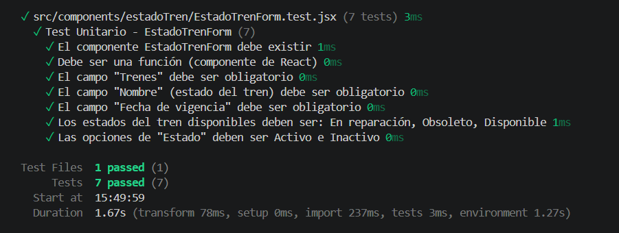
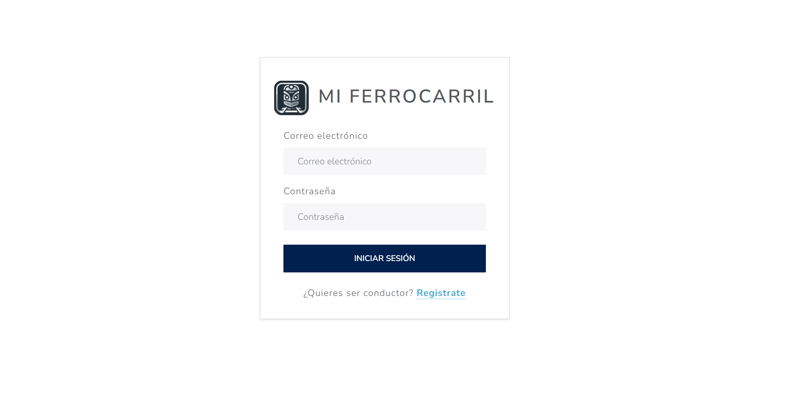

# Documentación del Proyecto - Mi Ferrocarril (FE-app)

Bienvenido a la documentación del frontend del proyecto. Aquí encontrará toda la información necesaria para entender, instalar y ejecutar la aplicación.

## Índice de Contenidos
- [Documentación del Proyecto - Mi Ferrocarril (FE-app)](#documentación-del-proyecto---mi-ferrocarril-fe-app)
  - [Índice de Contenidos](#índice-de-contenidos)
  - [1. Proposal](#1-proposal)
  - [2. Links a PR/MR y issues](#2-links-a-prmr-y-issues)
  - [3. Instrucciones de instalación](#3-instrucciones-de-instalación)
    - [3.1 Requisitos Previos](#31-requisitos-previos)
    - [3.2 Pasos de instalación](#32-pasos-de-instalación)
  - [4. Tecnologías utilizadas](#4-tecnologías-utilizadas)
    - [4.1 Core del proyecto](#41-core-del-proyecto)
    - [4.2 Gestión de datos y comunicación](#42-gestión-de-datos-y-comunicación)
    - [4.3 Navegación y formularios](#43-navegación-y-formularios)
    - [4.4 UI y visualización](#44-ui-y-visualización)
    - [4.5 Pruebas y calidad](#45-pruebas-y-calidad)
  - [5. Documentación de la API](#5-documentación-de-la-api)
    - [5.1 Base URL](#51-base-url)
    - [5.2 Referencia de la API backend](#52-referencia-de-la-api-backend)
  - [6. Evidencia de ejecución de tests automáticos](#6-evidencia-de-ejecución-de-tests-automáticos)
    - [6.1 Vitest](#61-vitest)
      - [6.1.1 Archivo de Test Disponible](#611-archivo-de-test-disponible)
      - [6.1.2 Ejecución de Test](#612-ejecución-de-test)
    - [6.2 Cypress](#62-cypress)
      - [6.2.1 Archivo de Test E2E Disponible](#621-archivo-de-test-e2e-disponible)
      - [6.2.2 Ejecución de Test](#622-ejecución-de-test)
  - [7. Tracking de features y bugs](#7-tracking-de-features-y-bugs)
  - [8. Deploy y Cloud](#8-deploy-y-cloud)
  - [8.1 Arquitectura de Despliegue](#81-arquitectura-de-despliegue)
  - [8.2 Configuración del Entorno](#82-configuración-del-entorno)
  - [8.3 Solución al Ruteo y Recarga (F5)](#83-solución-al-ruteo-y-recarga-f5)
  - [9. Demo de app en video](#9-demo-de-app-en-video)

## 1. Proposal 
- Proposal: [proposal.md](https://github.com/santifnob/tp/blob/main/proposal.md)
- Esta entrega documenta el frontend FE-app y su integración con el backend BE-app.

## 2. Links a PR/MR y issues
- Repositorio frontend: https://github.com/santifnob/FE-app
- Pull requests / merge requests: https://github.com/utnfrrodsw/tp/pull/181

## 3. Instrucciones de instalación

### 3.1 Requisitos Previos
- Node.js (versión recomendada 18 o superior).
- pnpm instalado globalmente.
- Acceso al backend de la API en `http://localhost:3000/api` o la URL configurada.

### 3.2 Pasos de instalación
1. Clonar el repositorio y posicionarse en la carpeta raíz del proyecto:
   ```bash
   git clone https://github.com/santifnob/FE-app.git
   cd FE-app
   ```
2. Instalar dependencias:
   ```bash
   pnpm install
   ```
3. Configurar la API backend en un archivo `.env` o como variable de entorno:
   ```env
   VITE_API_URL=http://localhost:3000/api
   ```
4. Levantar la aplicación en modo desarrollo:
   ```bash
   pnpm run dev
   ```
5. Abrir el navegador en `http://localhost:5173` (o la URL que indique Vite).

## 4. Tecnologías utilizadas
El desarrollo del frontend se ha basado en un stack moderno de JavaScript/React, seleccionando herramientas que priorizan el rendimiento, la experiencia de desarrollo y la mantenibilidad del código.

   ### 4.1 Core del proyecto
- **React 19** - biblioteca principal para construir la interfaz de usuario.
- **Vite** - herramienta de desarrollo y bundling rápida para el frontend.
- **pnpm** - manejador de paquetes eficiente para instalar dependencias.

   ### 4.2 Gestión de datos y comunicación
- **Axios** - cliente HTTP para consumir la API del backend.
- **@tanstack/react-query** - manejo de datos remotos, caché y sincronización con la API.

   ### 4.3 Navegación y formularios
- **React Router DOM** - enrutamiento de páginas y rutas dentro del SPA.
- **React Hook Form** - control y validación de formularios de entrada.

   ### 4.4 UI y visualización
- **Bootstrap** y **react-bootstrap** - estilos y componentes UI reutilizables.
- **Recharts** - visualización de datos en gráficos y dashboards.

   ### 4.5 Pruebas y calidad
- **Vitest** - framework de pruebas unitarias para componentes y lógica.
- **Cypress** - pruebas end-to-end para flujos de usuario.
- **ESLint**, **standard**, **@eslint/js** - reglas de estilo y calidad de código.
- **jsdom** - entorno de DOM para pruebas unitarias de componentes React.

## 5. Documentación de la API

### 5.1 Base URL
- `VITE_API_URL` (por defecto `http://localhost:3000/api`)

### 5.2 Referencia de la API backend
- Ver [documentación de API](https://github.com/santifnob/BE-app/blob/main/docs/README.md)

## 6. Evidencia de ejecución de tests automáticos

### 6.1 Vitest

#### 6.1.1 Archivo de Test Disponible
- `src/components/estadoTren/EstadoTrenForm.test.jsx` - Test para probar el estadoTren form

#### 6.1.2 Ejecución de Test
Para ejecutar el test:
- Comando: `pnpm test -- --run`
### Evidencia del resultado


### 6.2 Cypress

#### 6.2.1 Archivo de Test E2E Disponible
- `cypress/e2e/create_trip.cy.js` - Test para crear un viaje iniciando seccion como admin

### Ejecución de Test (visual)
Para ejecutar el test:
- Comando de ejecución E2E: `pnpm run cypress:open`
### Ejecución de Test (cmd)
Para ejecutar el test:
- Comando de ejecución E2E: `pnpm run cypress:run`
- Resultado:

  (Run Starting)

  ┌────────────────────────────────────────────────────────────────────────────────────────────────┐
  │ Cypress:        15.14.2                                                                        │
  │ Browser:        Electron 138 (headless)                                                        │
  │ Node Version:   v22.14.0 (C:\Users\xx\node.exe)                                                                  │
  │ Specs:          1 found (create_trip.cy.js)                                                    │
  │ Searched:       cypress/e2e/**/*.cy.{js,jsx,ts,tsx}                                            │
  └────────────────────────────────────────────────────────────────────────────────────────────────┘


────────────────────────────────────────────────────────────────────────────────────────────────────
                                                                                                    
  Running:  create_trip.cy.js                                                               (1 of 1)


  Prueba E2E de Crear Viaje
    √ debería iniciar sesión como admin y crear un nuevo viaje (5608ms)


  1 passing (6s)


  (Results)

  ┌────────────────────────────────────────────────────────────────────────────────────────────────┐
  │ Tests:        1                                                                                │
  │ Passing:      1                                                                                │
  │ Failing:      0                                                                                │
  │ Pending:      0                                                                                │
  │ Skipped:      0                                                                                │
  │ Screenshots:  0                                                                                │
  │ Video:        false                                                                            │
  │ Duration:     5 seconds                                                                        │
  │ Spec Ran:     create_trip.cy.js                                                                │
  └────────────────────────────────────────────────────────────────────────────────────────────────┘


====================================================================================================

  (Run Finished)


       Spec                                              Tests  Passing  Failing  Pending  Skipped  
  ┌────────────────────────────────────────────────────────────────────────────────────────────────┐
  │ √  create_trip.cy.js                        00:05        1        1        -        -        - │
  └────────────────────────────────────────────────────────────────────────────────────────────────┘
    √  All specs passed!                        00:05        1        1        -        -        -  

   

## 7. Tracking de features
- Features principales:
  - Gestión de conductores y licencias.
  - Gestión de trenes, estados de tren y viajes.
  - Gestión de cargas, recorridos y líneas de carga.
  - Dashboard analítico con métricas de viaje y conductor.
  - Cards visuales en los listados de entidades para dispositivos moviles
- Mejoras:
  - Validar rangos de fechas para viajes y licencias.
  - Controlar estado de disponibilidad del tren antes de asignar viajes.
  - Manejar sesiones de usuario y permisos en el frontend.

## 8. Deploy y Cloud

El frontend de **Mi Ferrocarril** se encuentra desplegado a través de **Vercel**. Esta elección garantiza baja latencia y alta disponibilidad para la interfaz de usuario.

## 8.1 Arquitectura de Despliegue

La aplicación es una **SPA (Single Page Application)** construida con React y Vite. El flujo de comunicación y despliegue se organiza de la siguiente manera:

1.  **Alojamiento:** Los activos estáticos (HTML, CSS, JS) son servidos desde los nodos de borde de Vercel.
2.  **CI/CD:** Se ha configurado un pipeline de integración y despliegue continuo vinculado a la rama `main` de GitHub. Cada cambio aprobado se despliega automáticamente.
3.  **Comunicación con la API:** El frontend consume los servicios alojados en **DigitalOcean** mediante peticiones HTTPS seguras.

## 8.2 Configuración del Entorno

Para la correcta vinculación con el backend, se configuraron las siguientes variables de entorno en el panel de control de Vercel:

| Variable            | Descripción                                                                        |
| :------------------ | :--------------------------------------------------------------------------------- |
| `VITE_API_URL` | URL base de la API en DigitalOcean (ej: `/api` si se usa proxy o la URL completa). |
| `VITE_FRONTEND_URL`          | Define la URL utilizada en el frontend.                              |

## 8.3 Solución al Ruteo y Recarga (F5)

Dado que es una SPA, se implementó una regla de **Rewrite** en el archivo `vercel.json` para evitar errores 404 al recargar la página. Esto asegura que cualquier ruta sea gestionada por `index.html` y procesada por React Router:

```json
{
  "rewrites": [
    { "source": "/api/:path*", "destination": "[https://tu-api-digitalocean.app/api/:path](https://tu-api-digitalocean.app/api/:path)*" },
    { "source": "/(.*)", "destination": "/index.html" }
  ]
}
```

## 9. Demo de app en video
- Puedes ver el video demostrativo del proyecto:
[](https://www.youtube.com/watch?v=FBNueOmiPjE)
