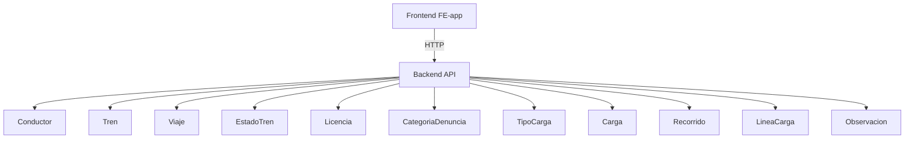

# Documentación del Proyecto - Mi Ferrocarril (FE-app)

Bienvenido a la documentación del frontend del proyecto. Aquí encontrará toda la información necesaria para entender, instalar y ejecutar la aplicación.

## Índice de Contenidos
- [1. Proposal](#1-proposal)
- [2. Links a PR/MR y issues](#2-links-a-prmr-y-issues)
- [3. Instrucciones de instalación](#3-instrucciones-de-instalación)
- [4. Documentación de la API](#4-documentación-de-la-api)
- [5. Evidencia de ejecución de tests automáticos](#5-evidencia-de-ejecución-de-tests-automáticos)
- [6. Tracking de features y bugs](#6-tracking-de-features-y-bugs)
- [7. Deploy](#7-deploy)
- [8. Demo de app en video](#8-demo-de-app-en-video)

## 1. Proposal 
- Proposal: [proposal.md](https://github.com/santifnob/tp/blob/main/proposal.md)
- Esta entrega documenta el frontend FE-app y su integración con el backend BE-app.

## 2. Links a PR/MR y issues
- Repositorio frontend: https://github.com/santifnob/FE-app
- Pull requests / merge requests: https://github.com/santifnob/FE-app/pulls

## 3. Instrucciones de instalación
1. Instalar Node.js (versión recomendada 18 o superior).
2. Instalar pnpm globalmente si no está instalado:
   ```bash
   npm install -g pnpm
   ```
3. Clonar el repositorio y posicionarse en la carpeta raíz del proyecto:
   ```bash
   git clone https://github.com/santifnob/FE-app.git
   cd FE-app
   ```
4. Instalar dependencias:
   ```bash
   pnpm install
   ```
5. Configurar la API backend en un archivo `.env` o como variable de entorno:
   ```env
   VITE_API_URL=http://localhost:3000/api
   ```
6. Levantar la aplicación en modo desarrollo:
   ```bash
   pnpm run dev
   ```
7. Abrir el navegador en `http://localhost:5173` (o la URL que indique Vite).

## 4. Documentación de la API
### Base URL
- `VITE_API_URL` (por defecto `http://localhost:3000/api`)

### Endpoints principales usados por la aplicación
- `POST /auth/login` - Autenticación de usuario.
- `POST /auth/logout` - Cierre de sesión.
- `GET /auth/check` - Verificar sesión activa.
- `GET /conductor` - Obtener conductores.
- `POST /conductor` - Crear conductor.
- `PUT /conductor/:id` - Actualizar conductor.
- `DELETE /conductor/:id` - Eliminar conductor.
- `GET /tren` - Obtener trenes.
- `POST /tren` - Crear tren.
- `PUT /tren/:id` - Actualizar tren.
- `DELETE /tren/:id` - Eliminar tren.
- `GET /viaje` - Obtener viajes.
- `POST /viaje` - Crear viaje.
- `PUT /viaje/:id` - Actualizar viaje.
- `DELETE /viaje/:id` - Eliminar viaje.
- `GET /estadoTren` - Obtener estados de tren.
- `POST /estadoTren` - Crear estado de tren.
- `PUT /estadoTren/:id` - Actualizar estado de tren.
- `DELETE /estadoTren/:id` - Eliminar estado de tren.
- `GET /categoriaDenuncia` - Obtener categorías de denuncia.
- `POST /categoriaDenuncia` - Crear categoría de denuncia.
- `PUT /categoriaDenuncia/:id` - Actualizar categoría de denuncia.
- `DELETE /categoriaDenuncia/:id` - Eliminar categoría de denuncia.
- `GET /licencia` - Obtener licencias.
- `POST /licencia` - Crear licencia.
- `PUT /licencia/:id` - Actualizar licencia.
- `DELETE /licencia/:id` - Eliminar licencia.
- `GET /tipoCarga` - Obtener tipos de carga.
- `POST /tipoCarga` - Crear tipo de carga.
- `PUT /tipoCarga/:id` - Actualizar tipo de carga.
- `DELETE /tipoCarga/:id` - Eliminar tipo de carga.
- `GET /carga` - Obtener cargas.
- `POST /carga` - Crear carga.
- `PUT /carga/:id` - Actualizar carga.
- `DELETE /carga/:id` - Eliminar carga.
- `GET /recorrido` - Obtener recorridos.
- `POST /recorrido` - Crear recorrido.
- `PUT /recorrido/:id` - Actualizar recorrido.
- `DELETE /recorrido/:id` - Eliminar recorrido.
- `GET /lineaCarga` - Obtener líneas de carga.
- `POST /lineaCarga` - Crear línea de carga.
- `PUT /lineaCarga/:id` - Actualizar línea de carga.
- `DELETE /lineaCarga/:id` - Eliminar línea de carga.
- `GET /observacion` - Obtener observaciones.
- `POST /observacion` - Crear observación.
- `PUT /observacion/:id` - Actualizar observación.
- `DELETE /observacion/:id` - Eliminar observación.

> Nota: la aplicación envía la mayoría de las solicitudes con `withCredentials: true`, por lo que el backend debe soportar cookies o sesión con credenciales.

### Esquema general de integración


## 5. Evidencia de ejecución de tests automáticos
### Vitest
- Comando: `pnpm test -- --run`
- Resultado actual: `1 archivo de prueba pasado`, `7 tests pasaron`.

### Cypress
- Comando de ejecución E2E: `pnpm run cypress:run`
- Comando de apertura local: `pnpm run cypress:open`

## 6. Tracking de features y bugs
- Features principales:
  - Gestión de conductores y licencias.
  - Gestión de trenes, estados de tren y viajes.
  - Gestión de cargas, recorridos y líneas de carga.
  - Dashboard analítico con métricas de viaje y conductor.
  - Cards visuales en los listados de entidades para dispositivos moviles
- Bugs y mejoras:
  - Validar rangos de fechas para viajes y licencias.
  - Controlar estado de disponibilidad del tren antes de asignar viajes.
  - Manejar sesiones de usuario y permisos en el frontend.
- Seguimiento en GitHub Issues: https://github.com/santifnob/FE-app/issues

## 7. Deploy
- Deploy no configurado en esta entrega.
- Recomendación futura: usar Vercel, Netlify o GitHub Pages para desplegar la build del frontend.

## 8. Demo de app en video
- Demo pendiente / TBD.
